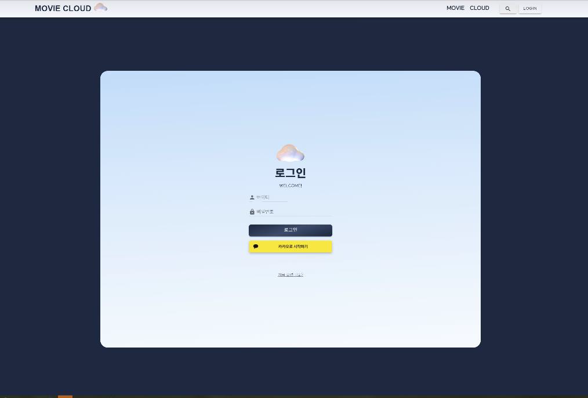

  

 

# 🎬 Movie Cloud  소개

- 컨셉 : **movie + cloud!** 
  + 현재 위치의 날씨 기반 영화 추천 + 물방울이 모여 하나의 구름 cloud (영화 기록)
- Main Topic :  날씨에 따른 영화 추천, 그리고 영화 기록 서비스 (방구석 1열의 영화로그)

 

# 👭 개발 인원 및 기간

- 개발 인원 : 2인
- 기간 : 2022.05.20 ~ 2022.05.27 (7일)

 

# 💻 개발 환경

- **Frontend** : Vue2, Vuex, Vuetify
- **Backend** : Django, Django REST Auth
- **DB** : SQLite
- **외부 API** : Geolocation API / OpenWeather API / KAKAO Login API / 영화진흥원 API / Youtube API / TMDB API

 

# 💡 주요 기능

- **로그인 / 회원가입**

  

  

- **현재 위치의 날씨에 따른 영화 추천**

  

- **현재 위치 근방 20km 내 영화관 조회 및 박스오피스 순위별 영화 조회**

  

- **평점 순 영화 조회 서비스**

  

  

- **영화 조회 (디테일)**

  

  

- **커뮤니티 및 게시글 CRUD**

  

  

 
