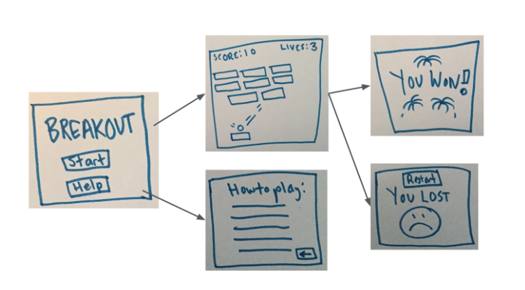

# Final Project 

https://story.pxd.co.kr/922

https://www.youtube.com/watch?v=vJNVramny9k

https://ko.khanacademy.org/computing/computer-programming/programming/good-practices/a/planning-a-programming-project

- 아이디어 구상

  컨셉 : 영화에 빠져드는... 느낌, 우리에게 빠져랑,,,

  Main Topic : 우리 서비스는 무슨 서비스?  영화 조회 및 관련 명소 추천 서비스

  기능 (우선 순위) : 

  

- DB 모델링

  

- 목업 구상 (유저 시나리오 구성)

  

  

- 디자인

  

- 기능 개발

  - API ?
  
    - tmdb
  
    - 로그인 - 카카오 등
  
    - 지도 
  
    - 극장 조회?
  
    - 국내 지역별 영화 드라마 촬영장소 및 시설 데이터 - 내 주변 혹은 궁금한 지역
    
      https://www.bigdata-culture.kr/bigdata/user/data_market/detail.do?id=8631a170-ed98-4bc1-8757-de0a4d75d85e