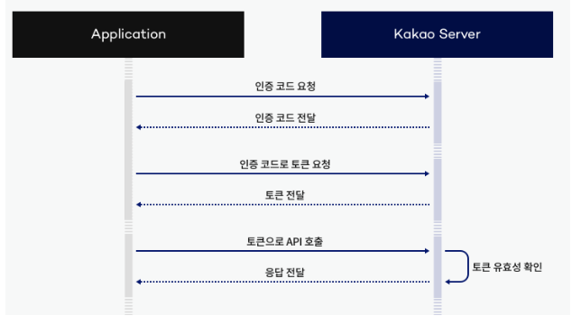
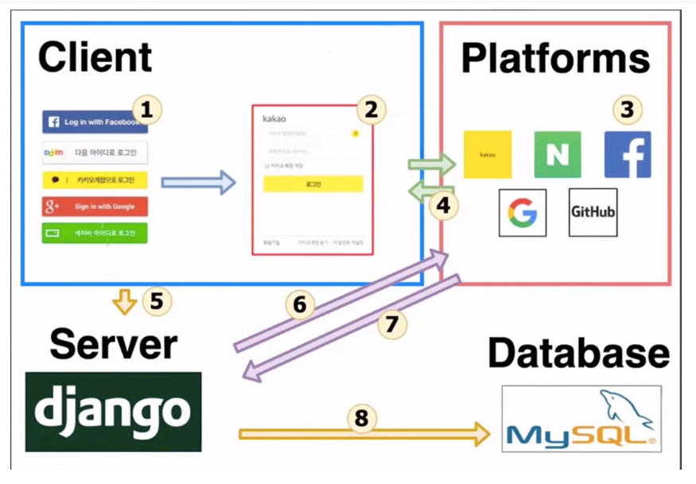

**카카오**

https://developers.kakao.com/docs/latest/ko/kakaologin/common

REST API 키 : 683d19aa3f66f6c7d4ca3b08f6f139ed

Javascript 키 : fcf79d7950891e2a0bcbec183a0187dd

Admin 키 : 50634426dfc0150423190cbcb41d99e9


- flow

  1. 인증 코드 요청 (javascript SDK)

  2. 받은 인증 코드를 통해 토큰 요청 (REST API)

     

     

- 구현 방법

  - **index.html에 javascript SDK 코드 삽입**

    ```html
    <script src="https://developers.kakao.com/sdk/js/kakao.js"></script>
    ```

    SDK?

    SDK란 Software Development Kit의 약자로, 소프트웨어 개발 도구 모음

    SDK는 API, IDE, 문서, 라이브러리, 코드 샘플 및 기타 유틸리티가 포함될 수 있음

    SDK는 프로그램 및 응용 프로그램 개발의 복잡성을 줄이는 강력한 기능 집합

  - **kakao javascript 키 설정 - main.js**

    ```JS
    window.Kakao.init('Javascript 키);
    ```

  - **카카오 인증 코드 요청 - views/KakaoLoginView.vue**

    ```JS
    loginWithKakao() {
                const params = {
                    redirectUri: "http://localhost:8080/auth",
                };
                window.Kakao.Auth.authorize(params);
            },
    ```

    => **인증코드에 받는 데 성공하면 redirectUri에 설정한 페이지로 이동하며, 쿼리에 인증 코드 정보가 담겨있음**

    여기서, 내가 지정해놓은 redirect uri를 잘못 작성해 토큰을 받는 uri로 redirect 되지 못해서 토큰을 받지 못함. 

    => 지정한 uri에 따라 views/KakaoLoginTokenView.vue로 redirect됨

  - **해당 인증코드를 들고 토큰 요청-  services/login.js**

    ```js
    const kakaoHeader = {
        'Authorization': '50634426dfc0150423190cbcb41d99e9',
        'Content-type': 'application/x-www-form-urlencoded;charset=utf-8',
    };
    
    const getKakaoToken = async (code) => {
        try {
            const data = {
                grant_type: 'authorization_code',
                client_id: '683d19aa3f66f6c7d4ca3b08f6f139ed',
                redirect_uri: 'http://localhost:8080/',
                code: code,
            };
            var esc = encodeURIComponent;
            var queryString = Object.keys(data).map(k => esc(k) + '=' + esc(data[k])).join('&')
    
            const result = await axios.post('https://kauth.kakao.com/oauth/token', queryString, { headers: kakaoHeader });
            const token_header = {
                'Token': result.data.access_token
            }
    
            const server_token = await axios.get(`http://localhost:8080/`, { headers: token_header });
            return result;
        } catch (e) {
            return e;
        }
    };
    ```

    => 토큰 받아옴

    => 실수

    1. 인가 코드를 Query String으로 전달받지 않아 몇 번이고 오류 발생 ⇒ 문서 잘보기
    2. uri를 통해 요청 보내는 데는 성공하지만 400 에러 발생 ⇒ 재로그인으로 해결 ( 새로운 인가코드 반영 x )


- 유저 정보까지 받아왔는데, 드는 의문점 => DB 연동과 DB 저장은? / 카카오로 로그인을 하는 것인가 회원가입을 하는 것인가?

  - ​           

    로그인 버튼을 누르면, 로그인 화면 불러오기 

    로그인이 되면, 카카오 서버에서 인증 후 access token 반환

    ------------------------ 클라이언트 해결 => 구현 완

    이후는 어떻게 운영?

    생각 ) 토큰을 백엔드에게 넘겨주면, 백엔드가 토큰으로 카카오서버에 접근 후 정보를 가져옴

    => id와 비교해 없던 데이터면 DB에 저장 - 회원가입

    => id와 비교해 있던 데이터면 유저 정보 가져옴 - 로그인

    id는 unique 값인 것을 확인!

    => 이후 백엔드가 토큰을 변환해서 주면 클라이언트는 그 토큰을 이용해 여러 조작들을 하면 될듯!

    ------------------------------

    그러면 DB를 따로 파야할까?


user 정보

id => id

is_superuser => 0

username => nickname

is_staff => 0

is_active => 1

date_joined => connected_At

----------------

프론트에서 redirect만 하고 백에 다 넘겨주었더니 데이터를 들고 돌아올 방법,,? 어떻게 해야할까?


프론트에서 카카오 api를 이용하여 로그인 화면 호출 (서버 연동)

=> 서버로 redirect 되면 해당 유저가 로그인

=> 유저 코드를 이용하여 토큰 얻고 유저 정보 get!

=> 이후 다시 프론트로 redirect해서 유저 정보를 서버에 넘길 서버 호출

=> 서버가 serializer로 유저 정보 넘김, 이 때 토큰은 암호화 처리됨!

=> 프론트가 유저 정보 받고 토큰 정보 받아 기존 유저 관계와 이어줌!
